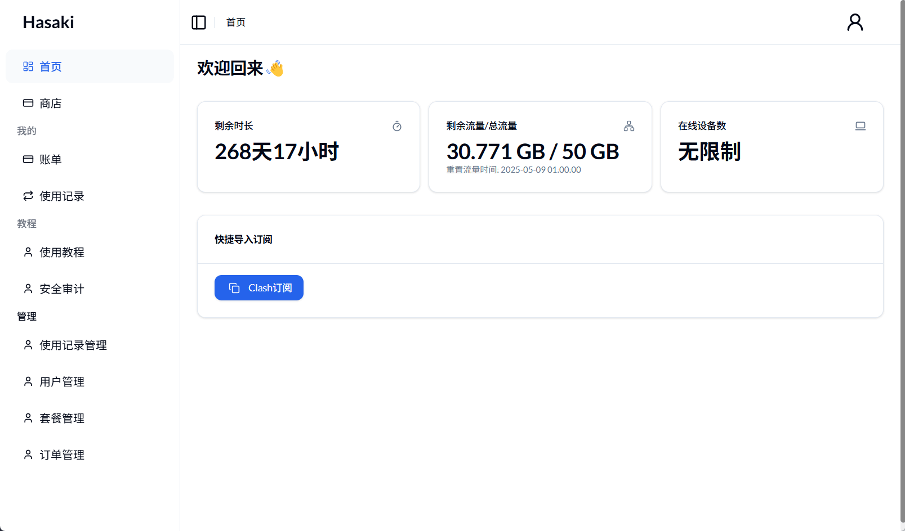
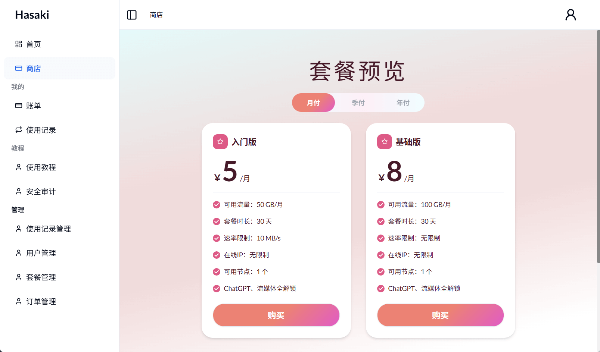
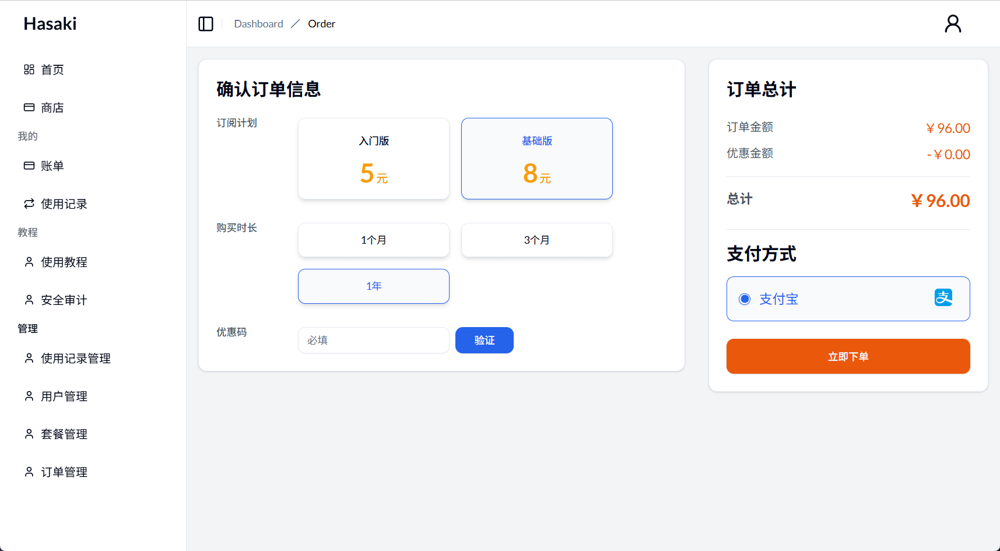

# 介绍

订阅管理平台。该系统负责创建用户、分配用户 ID 和流量配额，并将这些信息存储在 MySQL 数据库中。用户的信息将包括一个唯一的用户 ID 和一个流量配额。
# 功能
## 用户端
- [x] 首页
- [x] 登录注册
- [x] 商店购买
- [x] 个人中心
- [x] 订单中心
- [ ] 钱包

## 管理端   
- [x] 使用记录管理
- [x] 用户管理
- [ ] 套餐管理
- [ ] 订单管理 
- [ ] 服务器管理
 
# 开发
## 启动项目

1. 添加 application-dev.yml
2. mvn clean package
3. mvn spring-boot:run
4. 访问 http://localhost:8080/swagger-ui/index.html#/ 文档地址！

## 部署项目

1. 添加 application-prod.yml 文件到服务器任意目录 a
2. 复制 deploy.sh 到服务器目录 a 下并执行
3. sudo chmod +x deploy.sh
4. sudo ./deploy.sh

## 测试

curl -X 'GET' 'http://localhost:29999/user/isLogin'

# 技术选型

| 技术                  | 版本      | 说明                           |
|---------------------|---------|------------------------------|
| Java         | 17  | 开发语言                      |
| Spring Boot         | 3.0.4   | Spring 脚手架                      |
| satoken             | 1.38.0  | 一个轻量级 Java 权限认证框架，取代spring oauth2 |
| MyBatis             | 3.5.5  | ORM框架                        |
| MyBatisPlus         | 3.5.1 | 基于mybatis，使用lambda表达式      |
| spring-doc          | 2.5.0   | 接口文档工具                       |
| jakarta-validation  | 3.0.2   | 验证框架                         |
| redisson            | 3.19.1  | 对redis进行封装、集成分布式锁等           |
| logback             | 1.4.5   | log日志工具                      |
| lombok              | 1.18.26 | 简化对象封装工具                     |
| hutool              | 5.8.15  | 更适合国人的java工具集                | 
